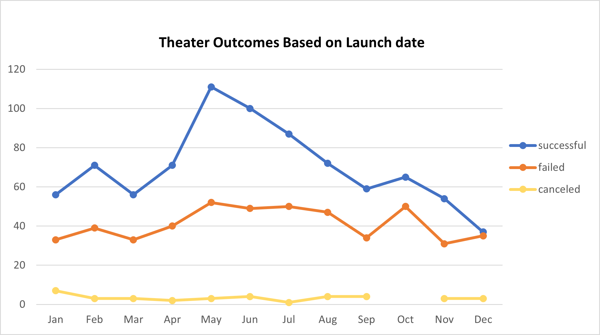
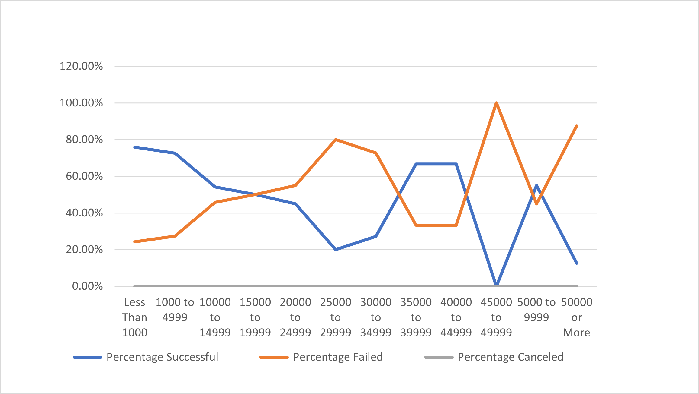

# Kickstarting with Excel

## Overview of Project- 

In this project we had to analyze how Lousie's campain had fared in relation to different campains
                          in relation to their launch dates and their funding goals. We focused mainly on plays as the play 
                        had come to close and we wanted to look at the outcomes of the campain

## Purpose -  

Purpose was to analyze monthly outcome of playby Lousie,and also looking at outcome based on launch date of plays.We also had to analyze the outcome of plays according to funding goals in percentages which were drawn into a line chart.            

## Analysis and Challenges - 
We started with renaming the excel sheet to kickstarter_Challange and extracting years from the date created column. Prior to that we already had created a parent column and a subcategory column since
we had to analyze specifically on plays. So now it was easy to create a pivot table 
                            
                             from kickstarter
                            sheet as we wanted to analyze whether the play was successful, failed and got cancelled based on months and including all 
                           years it was played. 
                           We also wanted to analyze the percentages of successful, failed and cancelled palys based on their goal outcomes.For this we had to 
                           use counts and sums function so that the relation between both could be analyzed or assessed. All this information finally helped 
                           Lousie in analyzing how her palys had done during the campain.
                           There were no hard challanges in this exercise. However, challanges could be with respect to how to use formulas to get desired outcome.
                           Some colud also encounter issues with respect to pivot table while trying to draw outcome based on analyses.

### Analysis of Outcomes Based on Launch Date

### Analysis of Outcomes Based on Goals
Below is the line graph showing outcomes based on Goals

## Results

- What are two conclusions you can draw about the Outcomes based on Launch Date?

First conclusion we draw is - Campain had a good success in the beginning after its launch but towards the later half of year it dropped down, again rising and dropping
    Second conclusion- By the end of the year the faliure rate was almost double than its success rate. Cancellation rate of plays was less.                                     
- What can you conclude about the Outcomes based on Goals?

 Outcomes based on goals shows us that when the goal was less than $1000 to uptil $10000 the plays had  more chance of success percentages. As the goal
       was increased we did see some brief success before it dropped down. So in short, higher goals dropped the success of plays.  
- What are some limitations of this dataset?
  
Limitations of a dataset could be realiability such as any missing data as we had zeros in some fielsds or variables. Another could be lack of previous data
         for comparision to look at the success rate of plays. Though some years were taken into consideration but among the years as well we can compare and see which year
         went good.
- What are some other possible tables and/or graphs that we could create?
  
Other possible tables and graphs that we could create can be on other categories and subcategories. We can also cross relate subcategories to see how a particular category or 
          subcategory performed compared to another. 